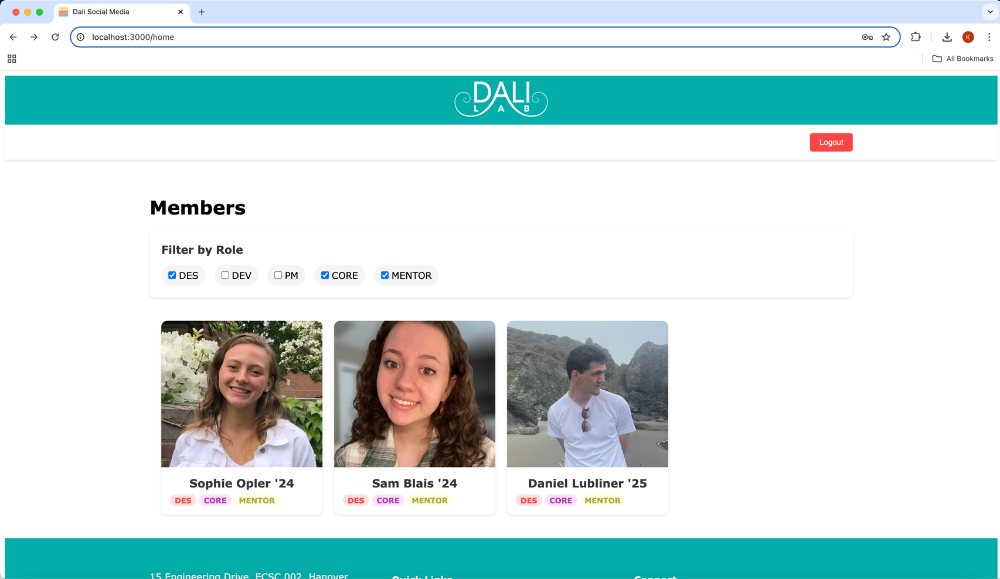

# Dali Social Media Challenge

## Project Features
* Fully interactive social-media UI application
* Comprehensive home page, with the ability to filter lab members by roles
  * Dev, Des, PM, Core, Mentor
* Full authentication system using JWT 
  * Sign up, sign in, logout functionality
  * Email validity checker
  * Password security verifier 
* Varying levels of access
  * Supports differing User and Admin permissions 
* Conveniently add members using JSON format
  * Creates default account information (email and password) for new members 
* Detailed member profile pages 
  * Complete with images
* Functional Dali logo "home" button 
  * Routes to the main page
* Dali Lab favicon
* Small animations when hovering over clickable elements of the site
* Website footer with accurate embedded social media links 

## Project Overview

Dali Social Media Challenge

This project includes a backend REST API built with Spring Boot as well as a frontend social-media-like UI built with 
ReactJS. The project uses PostgreSQL for data management. 


## Screenshots 
Homepage


Filter demonstration 


Profile page


Sign up page


Sign in page


Site footer


## Setup Instructions 
clone the repository 
```bash
git clone 
cd repository
```

install backend dependencies with Maven
```bash
cd backend
./mvnw clean install
```

install frontend dependencies with Node Package Manager (NPM)
```bash
cd ../frontend
npm install
```
configure the database
```properties
spring.datasource.url=jdbc:your_database_url
spring.datasource.username=your_usename
spring.datasource.password=your_password
```

add private security key
```Java
// .../SecurityConstants.java
    public static final String JWT_KEY = SECURITY_KEY;
// works with keys of length 256, 384, or 512 bits (32, 48, 64 bytes)
// ex. https://generate-random.org/encryption-key-generator
```
## Run the Project Locally

```bash
cd ../backend
./mvnw spring-boot:run
```
```bash
cd ../frontend
npm start
```
The backend API is set to run on http://localhost:8888.
The frontend application is defaulted to http://localhost:3000.

## Learning Process
### Project Inspiration 
I initially decided to create this project because I was excited to practice my object-oriented programing skills. I 
began at the start of Winterim, and having just completed CS10, I saw the structure of Dali lab as a great opportunity 
to use these skills. As such, I opted to build this project with a Java backend (using Spring Boot). While it is not 
the most popular backend framework, I found that as I had been working with Java throughout the fall the framework was 
straightforward to learn. I was able to focus on learning the different elements of a Spring Boot application without 
overly dealing with syntax errors or other language-specific issues. 

I encountered lots of challenges throughout this process, the largest of which was user authentication. I opted to
add it as a challenge to myself. As a Math and CS major I am very interested in the math behind algorithms, and the 
chance to work with hashing and JWT was exciting to me. This ambitious goal proved to be much more difficult than I 
expected, and I ended up spending many hours implementing the features to add users to a database, generate JWT tokens
for secure and convenient authorization, use hash functions for all operations regarding passwords, and to store this
information using cookies (if you are logged in to the site and reload the page you stay logged in). 

### Impact
I believe that this user-friendly application could help members of the lab better engage with each other, and with 
broader communities. On one level, the application could be used for members to get to know one another. As each member
has a unique page complete with personal information, this could be a great way for new hires to learn about fellow 
lab members and for organic conversations and bonding. From the outside looking inward, the site could also be used for 
Dartmouth students to learn about members of the lab. For example, if a student wants to learn more about the lab's work
or the lab's application process, they may be more inclined to do so if they see a familiar face among its members. 
This could also be a great way for partners of the lab to see the faces behind Dali. It could be very exciting and 
rewarding for potential partners to have a virtual overview of the lab members, possibly increasing applications and 
bolstering interest. 


### New Technologies 

- Spring Boot
- ReactJS
- PostgreSQL
- JWT

Much of this project involved new technologies for me. Beforehand I had experience with Java, but not specifically with 
backend development. I had not used Javascript (or React) before this project, and was able to build my frontend
due to many hours of reading documentation, watching tutorials, and experimenting. I also did not have experience using
databases, and learned basic elements of PostgreSQL for this project. 

As mentioned in the Project Inspiration section (4 paragraphs up) I opted to using Spring Boot because of my desire to 
expand my OOP abilities (using Java). I considered using other frameworks with a shallower learning curve 
(e.g. Flask, Django) but opted to build in the language I was most familiar with at the time. I opted to build the 
frontend in React because of its widespread use – both in the lab and in industry – and practicality. I reasoned that 
beginning to learn React was an investment of my time that I would certainly benefit from going forward. As for the 
choice of database I did not have strong feelings: I opted for an SQL-based configuration due to the highly organized 
nature of the provided data. 

I briefly touched on challenges faced in the earlier section (4 paragraphs up) but will elaborate here. JWT 
authentication aside, my biggest struggle was learning React. I found that some quirks of the framework 
(state management, hooks) were not concepts that I had seen before, and did not come to me intuitively. I ended up 
following tutorials and building a simple task manager application in React to give me a better understanding of these
concepts. One major takeaway for me was this lesson: time is much better spent working on a small-scale project to 
fully understand a technology and after returning to the larger-project vs. trying to skip these foundational
steps or debug your way through an issue. I also learned the complexities of full-stack development: I had so many 
different ideas that I would have loved to implement, but lacked the time to (ex. profile editing, password reset, more
user personalization). 


### Sources Used
- [Spring Boot Docs](https://spring.io/projects/spring-framework)
- [ReactJS Docs](https://react.dev/learn)
- [PostgreSQL Docs](https://www.postgresql.org/docs/current/)
- [ReactJS & Spring with JWT Authentication](https:www.youtube.com/watch?v=bqFjrhRrvy8)
- [JWT with React](https://clerk.com/blog/adding-jwt-authentication-to-react)
- [Claude 3.5 Sonnet](https://claude.ai/new) & [GPT-4o mini](https://chat.openai.com/) used for debugging as well as conceptual explanations 


